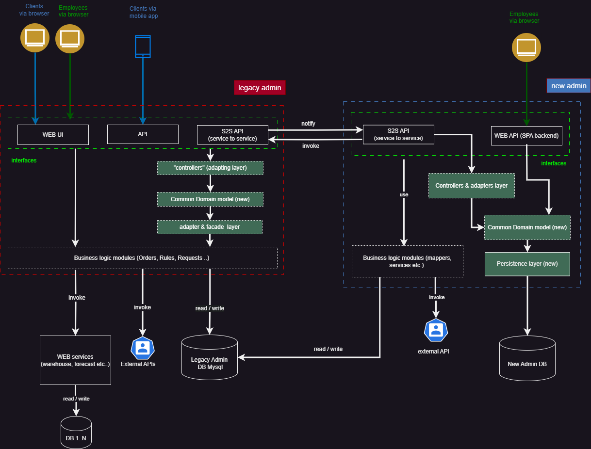
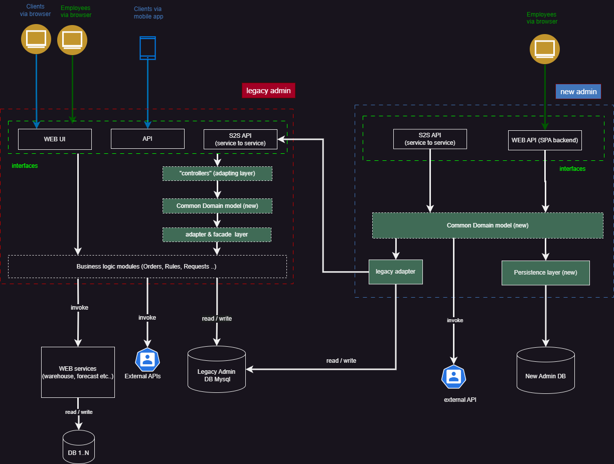
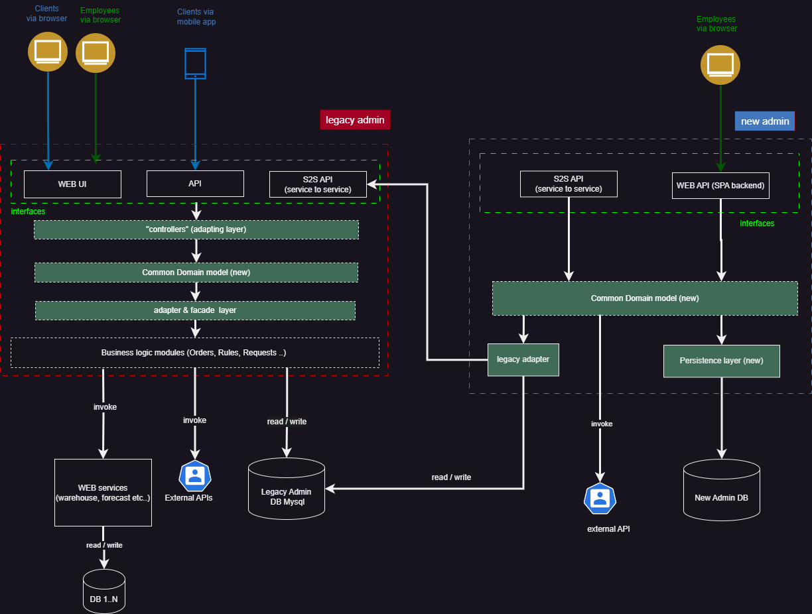
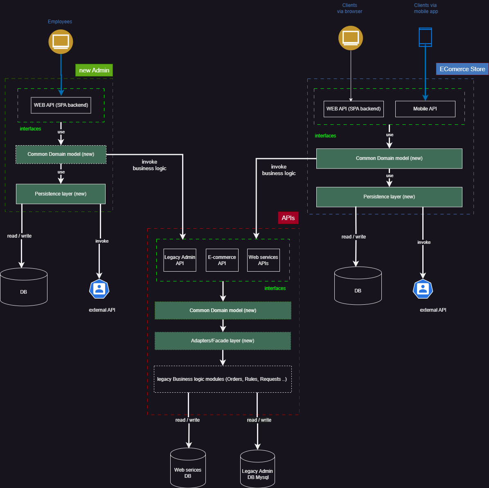
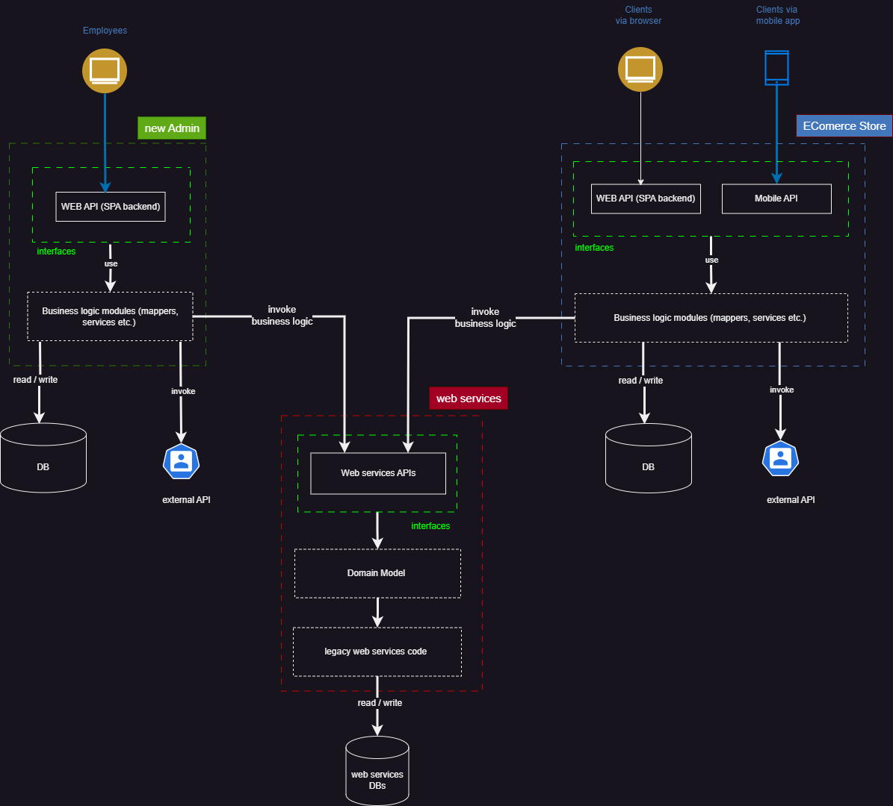

# ref-ex
refactoring exercise

# current state

### structure 

### deployment

## current issues with Legacy admin
- (accidentally = for no good reason) Large code base (tens of thousands of lines of legacy code)
- Business logic exists in all layers: from BL to "views" ( = no layers with defined responsibility, no ORM etc., business logic is scattered accross application)
- Tighly coupled modules ( = brittle, easy to break, hard to isolate into horizontal capabilities/domains)
- No standard (based on well known libraries) way of doing standard things (e.g. sending emails, talking to database etc.) , everything is custom ( = requires deep knowledge of the system)
- deployed as single instance (issues with sessions affinity and files)
- single point of failure (because of single instance )
- near the limits of possible performance  ( no way to scale out because sessions and files are stored locally)
- Web services and Admin application are hosted together ( = compete for resources)
- deployment process is manual ( = requires skills and time)
- no easy way to rollback ( = risk of downtime)
- no DR solution
- no way to avoid downtime ( = bad for business)
- no easy way to test ( IaC and automation is needed to fix)

as result of all above - hard to maintain/add features ( moreover, adding more code, potentially only exacerbates the situation )

## current issues with new admin
- no clearly defined domain model ( => business logic is vaguely defined between 2 applications)
- reads and writes go to legacy DB ( => adding more complexity)
- bi directional s2s API ( => coupling, which new admin is called to eliminate)
- absence of layers:BL, ORM, Persistence ( => potentially leads to unmaintainable code)

## steps to take towards long term (final) state:

<h3> Milestone 0 </h3>

#### Goals:

- Containerize and automate deployment of all elements (all DBs, UIs etc)  
- Add ability to take snapshot (image) from prod, (including DB) and test all code against prod db (locally deployed)
- Introduce integration testing (Red-green-refactor approach) for development of new code into both Admins (Legacy and New) into "Definition of Done"
- Prepare Legacy Admin and put it behind LB
   - move sessions outside host
   - get rid of config files (refactor)
   - move file storage to S3 (refactor)
- move web services to its onw host/container   
- Start using design patterns in order to achieve horizontal and vertical decoupling of business logic, improve readability of code ( horizontal -  modules, vertical - layers), where it makes sense. Use patterns such as:  Facade ,  Adapter , Strategy , Visitor, Factory, Decorator
   - Once a pattern is established, try to stay within boundaries of newly created services/layers to achieve new functionality ( consistency)   

<h3> Milestone 1 </h3>

#### Goals:

- Start developing Common Domain Model ( shared by both applicaitons): this will allow to maintain status quo and start transitioning to new (layered) architecture
- start decoupling Admins at DB level (new Admin can now use its own DB using proper layered approach)
- new functionality now on will enrich CDM (being clearly defined in one place)
- No need for "big bang" rewrite: both interfaces (in legacy and new admins) can be gradually refactored to use new laters

### components' description

  

#### legacy controllers ("controllers" layer)
Removes dependencies of all interfaces to legacy business logic "containers/modules". Instead, interfaces now only depend on common domain model (CDM) 
This allows to move those interfaces from legacy admin eventually 

#### Common domain model (layer)
consists of description of 
 - data types (entities with ID)
 - value objects (things related to entities but having no identity = no ID)
 - domain operations (business logic operating with entities, e.g. create_order(order))

Domain model describes what application is really doing, it is recommended to brake it into independent modules (horizontally). 
It may(and should) be shared between new and legacy admins as a package ( independent project factored out into publishable package)

#### adapter & facade  layer
is responsible for implementation of domain operations defined in CDM layer 

<h3> Milestone 2 </h3>

#### Goals:

- All business logic in new admin flows via CDM ( Common domain model is mature enough to include all business logic definiton )
- Legacy adapter layer (in new admin) is interpreting data access logic for CDM
- Legacy to New admin communication is made unidirectional: only new admin talks to legacy admin (not the other way around) 

<h3> Milestone 3 </h3>

#### Goals:

- CDM layer is mature enough to include all buisness logic available via UI interface of Legacy ADMIN (prerequisite to move UI out of Legacy admin in later steps)
- admin's UI is isolated by CDM layer

<h3> Milestone 4 </h3>

#### Goals:

- E-commerce service is moved out from new admin into a standalone component
- Legacy e-commerce UI is decommisioned and all functionality now exists in new e-commerce
- Legacy Admin only exposes APIs

<h3> FInal milesone </h3>

#### Goals:

- Legacy Admin is sunset, only web APIs are used
- Every application is factored out into separate component
- every service is horizontally scalable

